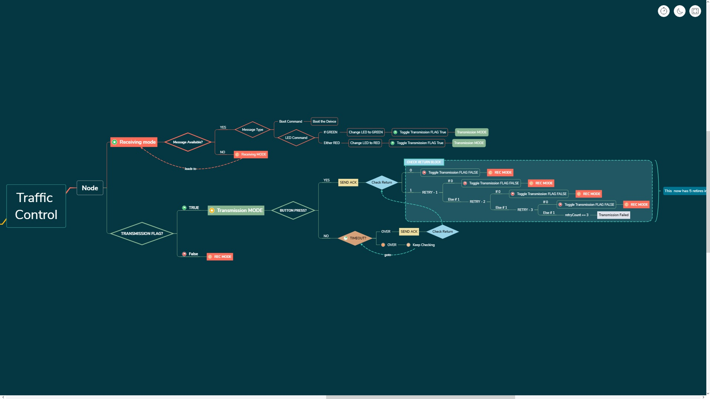

# Project Name - Lora based Taffic Control System

## Project Members:
* Momshad Dinury
* Abdullah Zowad Khan
* Towqir Ahmed Shaem

## Project Description:
The system is built using devices of two types: node and controller; one controller per system and a maximum of four nodes connected to it. The controller device uses an esp32, a dual-core SoC, with wifi and bluetooth functionalities. The system uses a NEXTION display for the status of the nodes associated with it. For the communication side, LoRa (Long Range) radio module is used. LoRa is widely known for its efficiency in sending short messages quickly and reliably. LoRa uses a transmission method called Chirp Spread Spectrum (CSS) which is used mostly in military and space communications for low power solutions. And lastly, in the nodes, ESP8266 and LoRa are used.

The process begins with the controller rebooting and syncing the nodes. The reboot and sync is done to ensure there is no data loss in regular operations. Each node upon reboot sends a successful boot message, which is used to show the status of the mentioned node.

The signaling is done by pressing specific buttons on the controller. Upon pressing, the controller sends the appropriate signal to the node through LoRa. The system has a timeout of ~15 seconds on communication, after that the attempt is marked as failed. After the node receives the signal, it switches the LEDs on the node then transmits appropriate acknowledgment packets. The display on the controller has a timer so the operator can easily decide whether enough time has passed for a given state at a given lane. The signals sent to each node are independent of the others, which allows the operator to shut down all lanes in case of an emergency.


## Shortcuts
* [**Controller Algorithm Overview**](#controller-algorithm-overview)
* [**Node Algorithm Overview**](#node-algorithm-overview)

## Controller Details

[**Controller.ino**](https://gitlab.com/Momshad/Lora-Traffic-Control-System/blob/Controller-Adjustments-Timers-Displays/Controller/Controller.ino)

### Interrupt Handlers

```cpp
void ISR_DB_1();
void ISR_DB_2();
void ISR_DB_3();
```

Display timers attached to:
```cpp
void Setting_Block_State_Color();
void showTime();
```

## Version 1 Configuration

* Display - TFT
* MCU - esp8266
* Communication - RF (LoRa Module)

## Version 2 Configuration

* Display - 4 Nokia 5110 Transflective Display
* MCU - ESP32
* Communication - Unchanged

### Controller Algorithm Overview


### Node Algorithm Overview
    
